Descargo la maquina backend de Dockerlabs, seccion Facil

Hago un nmap para ver puertos abiertos y versiones

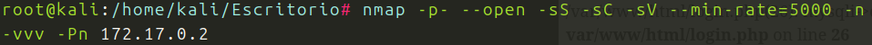
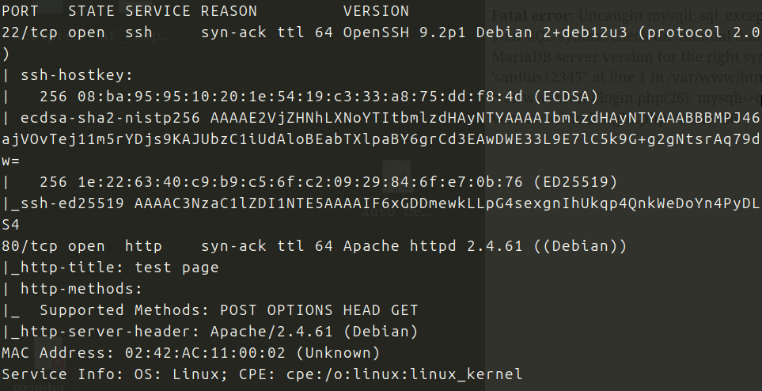

Puerto 22 y 80 abiertos.
Compruebo posibles exploits para las 2 versiones, no hay nada.
Voy al navegador y encuentro este panel de login

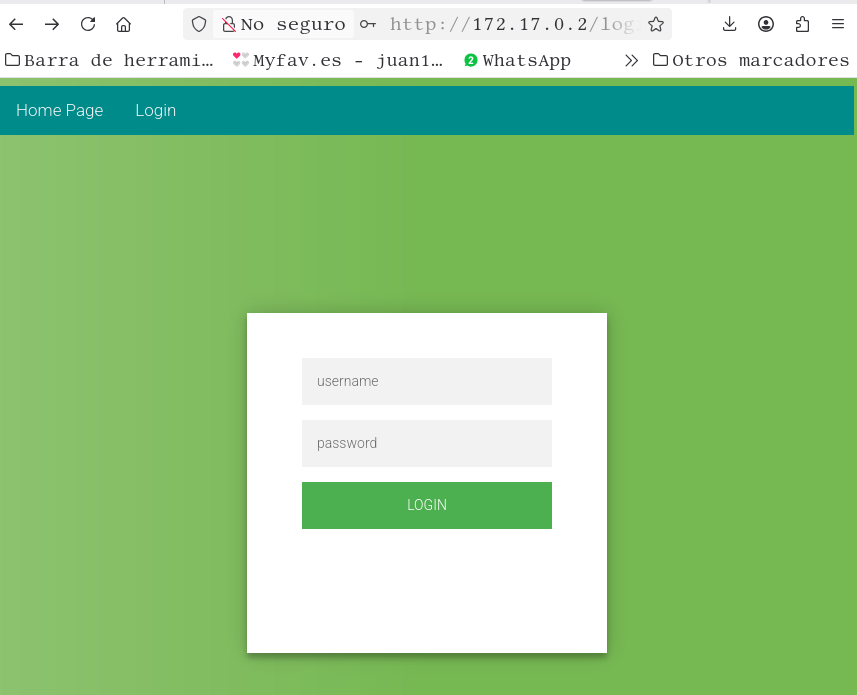

Tras hacer un par de pruebas, obtengo este mensaje:
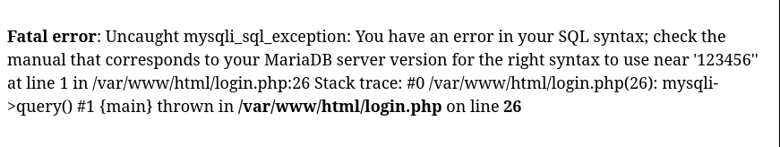

Posiblemente vulnerable a SQLi.
Primero interceptare la peticion del login con BurpSuite.
Segundo usare SQLMap, para extraer info de las bases de datos que haya.

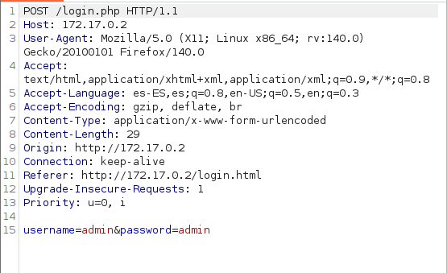

Interceptado por BurpSite, lo paso al archivo captura.txt, para usarlo con SQLMap

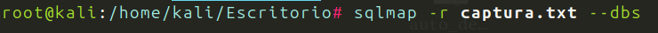
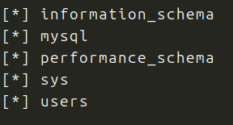

Bases de datos, parece que users es en la que hay que entrar:

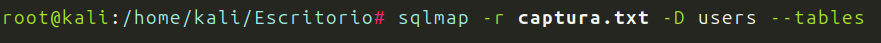
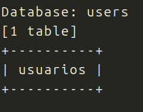

Entramos en usuarios:

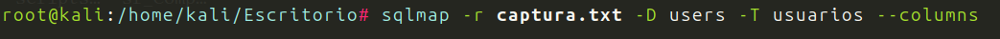
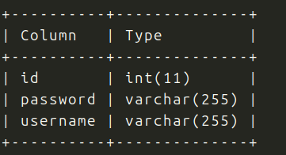

Veamos que hay dentro de username:

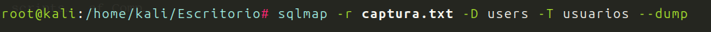
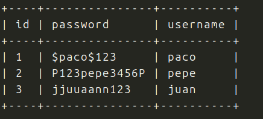

Tenemos usuarios y contraseñas, vamos a probar con SSH.
Para paco y $paco$123, no funciona
Para pepe y P123pepe3456P

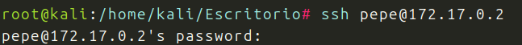
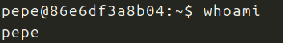

Estamos dentro, somos pepe.

**Escalada de Privilegios**

Sudo -l, no funciona
Pero si en cuentro binarios:

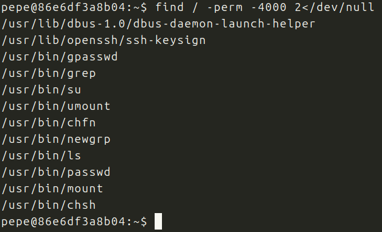

Atencion tenemos ls y grep
Busco en GTFObins, no encuentro nada.
A ver si puedo listar con ls y leer en el archivo root.

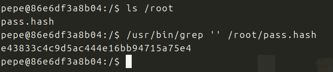

Ahi esta y sabemos que es un hash, intentare con CrakStation:

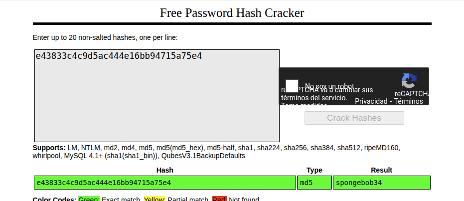

Tenemos contraseña probamos:

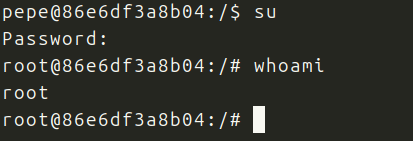

Conseguido, soy root !!!
