Candy es una maquina de Dockerlabs, de la seccion Facil

Descargamos, descomprimimos y corremos la maquina.

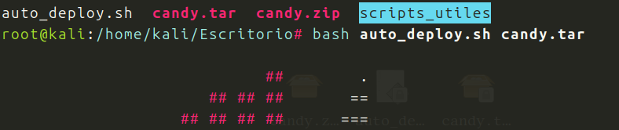

Hacemos un nmap, para ver puertos y servicios:

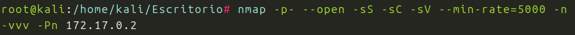
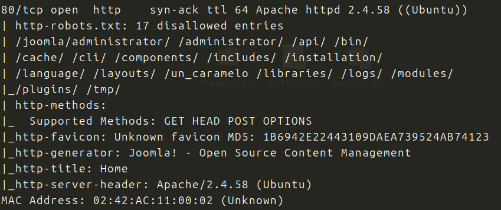

Puerto 80 abierto, veamoslo en el navegador:

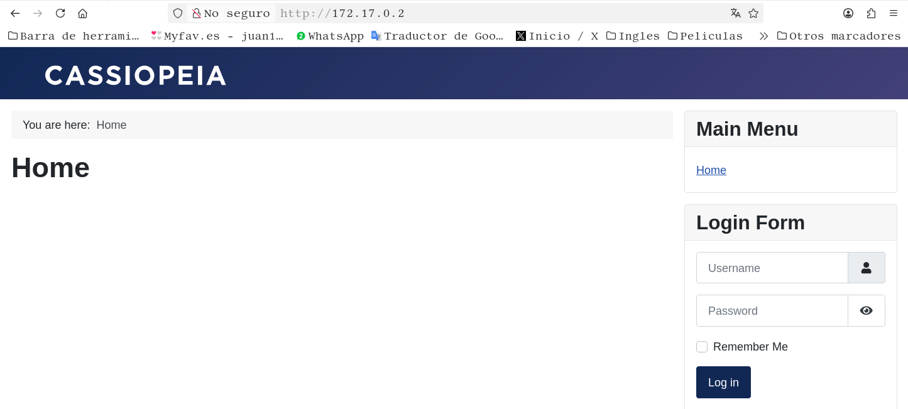

Vemos un Panel de Login, pero no tenemos mas informacion.
Hacemmos fuzzing con gobuster:

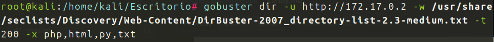

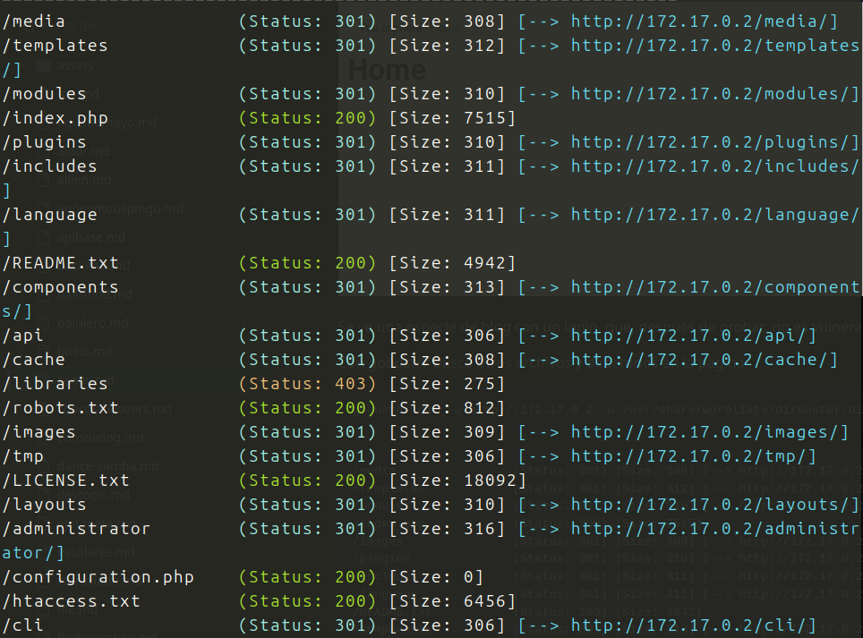

Bien por  la salida, vemos que es un CMS, un Joomla, vemos /templates, adminstrator/ ...y /robots.txt, veamos que hay ahi:
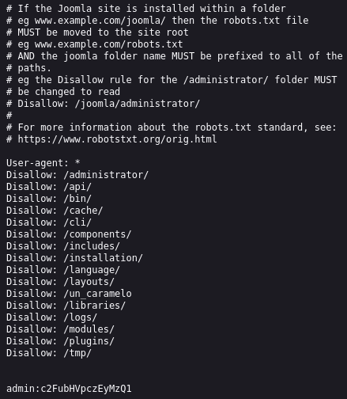

admin y contraseña, no funciona directamente, esta en Base64, la decodificamos:

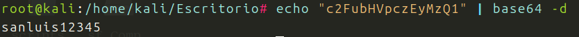

Probamos a entrar logeandonos en administrator:

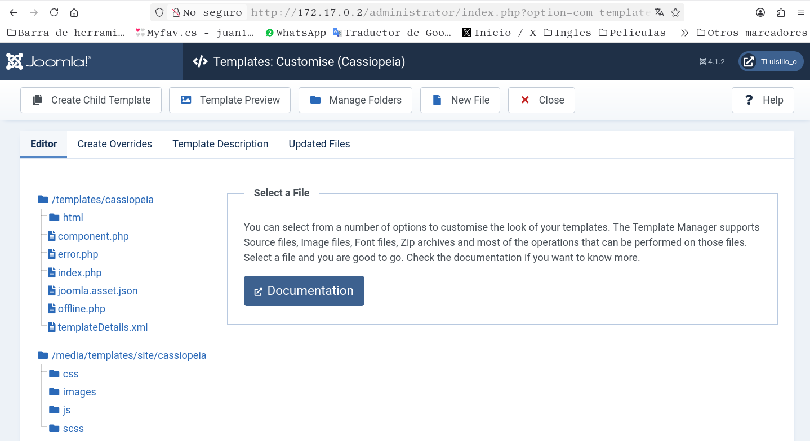

Estoy dentro, en templates, donde veo que tengo el archivo error.php(que podria editar) o la posibilidad de crear uno nuevo. Voy a crar un archivo .php, que al abrirlo me de de una revshell.

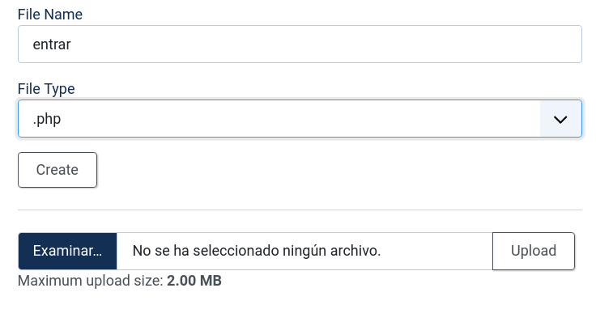
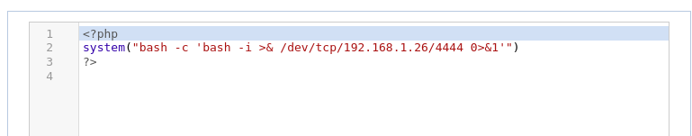

Creamos el archivo con un payload basico y lo guardamos, escuchamos desde el puerto 4444:

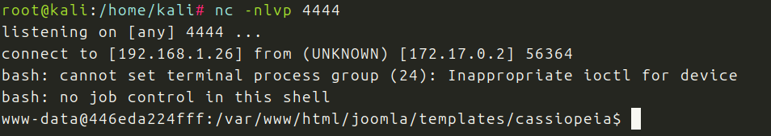

Estamos dentro. Lo primero haremos el tratamiento de la TTY, para tener una shell mas estable.

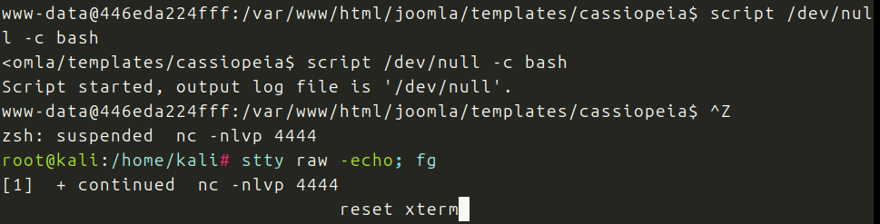
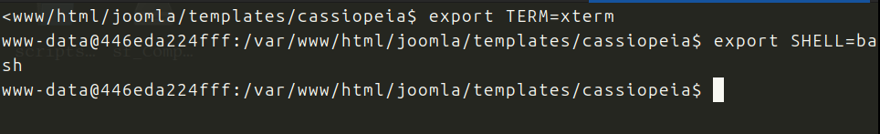

Tenemos conexion estable.
Buscamos archivos que nos puedan dar alguna pista:

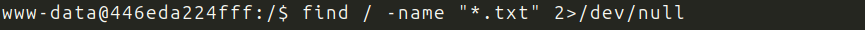
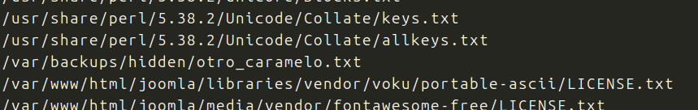

Aqui hay algo curioso, lo abro:

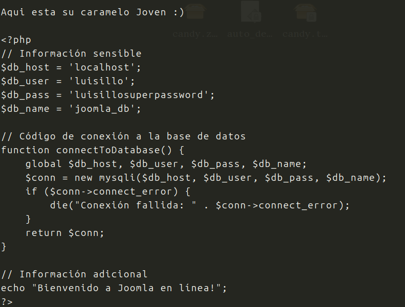

Informacion muy interesante.
Con la informacion que tengo, entro en luisillo y veo que con el binario  dd puedo acceder a root

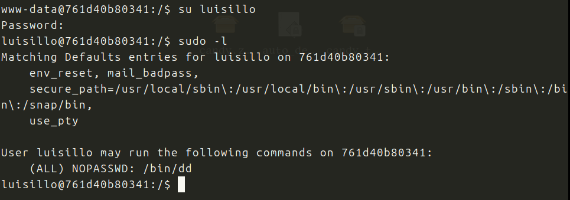

Voy a GTFObins:
Segun GTFObins, dd permite redirigir contenido hacia archivos con permisos de root; asi que puedo sobreescribir /etc/sudoers. 
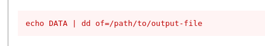

Probamos:

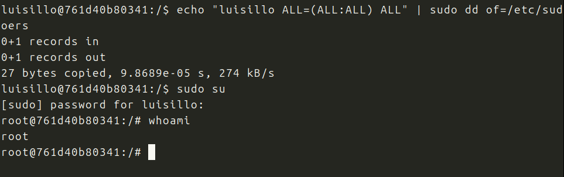

Soy root
