Maquina de Dockerlabs, seccion Facil.

Descargo, y corro la maquina.
Hago un ping para ver si hay conexion

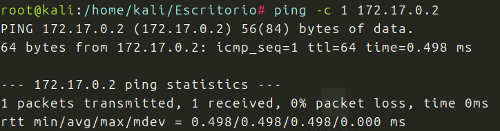

Hago un nmap para ver puertos abiertos y versiones, vemos el puerto 80 y el 22 abiertos

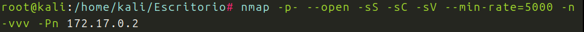
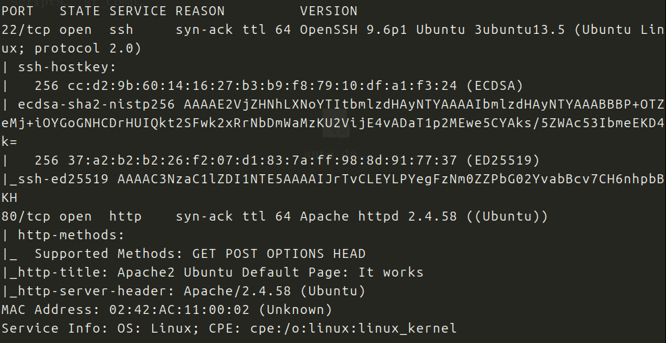

ttl 64 Linux
Compruebo posibles exploits para las versiones, nada.
whatweb no me dice nada interesante.
Voy al navegador, y encuentro esto:

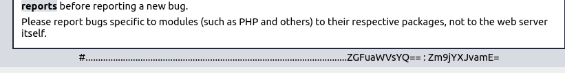

Esta en base 64, lo decodifico, parece que tenemos un posible usuario y contraseña

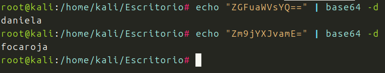

Probando con SSH

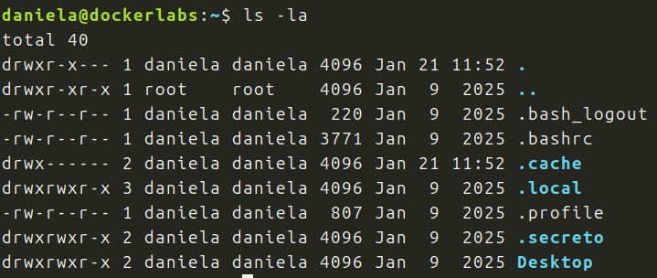

Somos daniela, y parece que hay archivos interesantes.

Dentro del directorio secreto, hay un archivo, y este nos muestrauna posible contraseña para diego, otro usuario, que confirmo entrando en /home

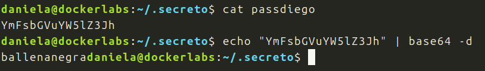

Comprobamos que diego y ballenanera son validos

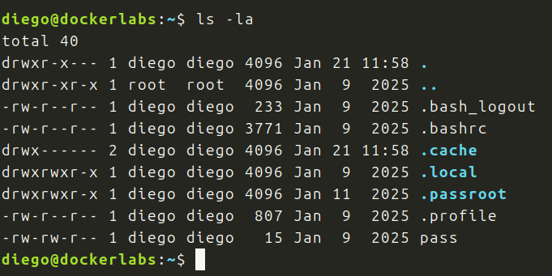

Son validos, somos el usario diego.

Pruebo con sudo -l, nada

Pruebo listando binarios, nada

Busco archivos y encuentro esto

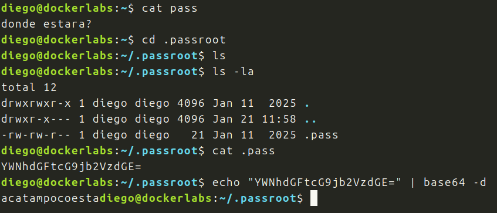

Busco mas

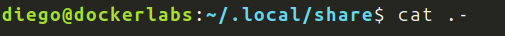
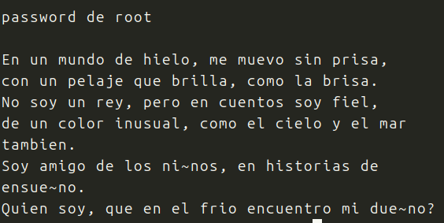

Encuentro este archivo, con una especie de adivinanza, solucion: osoazul

Lo pruebo con diego:

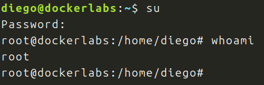

Somos root !!!

