Maquina de la seccion Facil de Dockerlabs

Descargo, descomprimo  y corro la maquina.

Nmap completo, para ver puertos abiertos y servicios

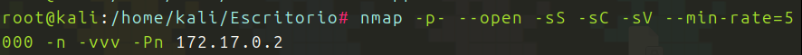
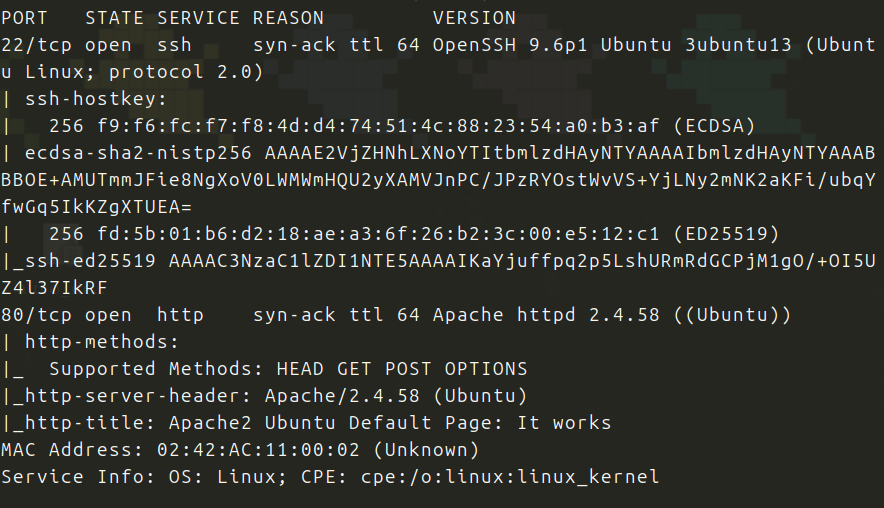

Veo el puerto 80 y el 22 abiertos. Voy al navegador y me encuentro esto:

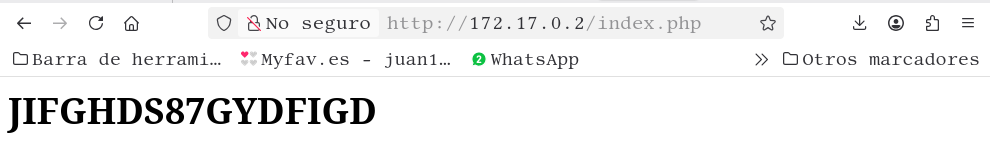

Podria ser una contraseña, la pruebo con hydra:

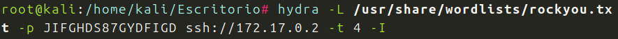
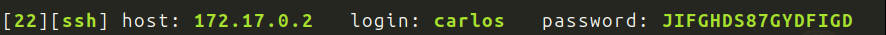

Tenemos usuario y contraseña, entramos por SSH

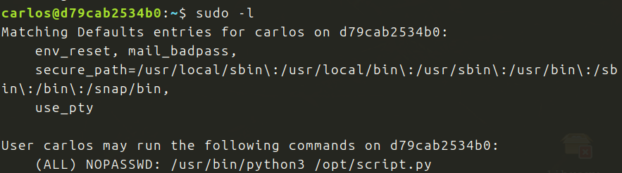

Estamos dentro, y comprobamos que podemos ejecutar un script con python3.

Me ubico en la carpeta y leo el script:

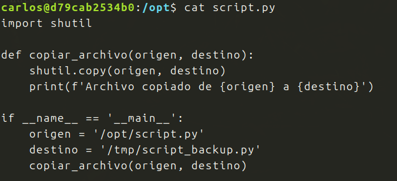

El problema es que no puedo editarlo, pero si puedo borrarlo, porque tengo permiso de ejecucion:

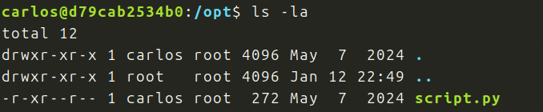

Puedo eliminarlo y subir otro en su lugar, con el mismo nombre con el contenido que yo quiera:

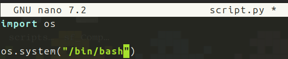

Y le doy permisos:

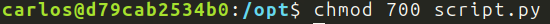

Ahora ejecuto el archivo, con toda su ruta:

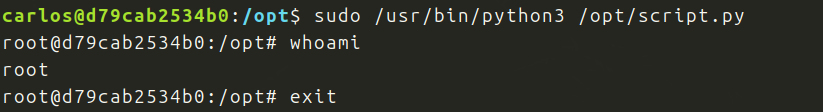

Soy root!!!!
