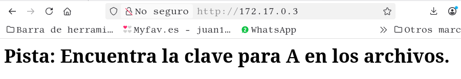
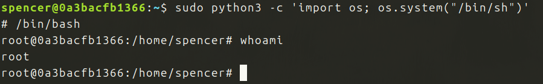

Primera maquina de la session Facil de Dockerlabs

Descargo y despliego la maquina.

Primero empezare con un escaneo de puertos:

Muestra los puertos 22 y 80 abiertos.

Voy al navegador:

Encuentro la primera pista, 'a' podria ser un usuario, voy a probar con hydra:

Conseguido: password es *secret*

Entro mediante SSH:

Estoy dentro y soy el usuario a.

Busco informacion dentro del usuario a.
He encontrado mucha informacion:

En el directorio srv a veces puede haber informacion, en este caso, parece que mucha..

Tambien he encontrado otro usuario:

Sin duda, con estas pistas se podra resolver la maquina, voy a hacer fuerza bruta con el nuevo usuario, la opcion mas facil, si no funciona comenzare con las archivos de texto:

Mucha suerte, tenemos password, probamos por el puerto 22:

Bien estamos dentro y el comando sudo -l funciona, tenemos permisos usando el binario python3. 
Voy a la pagina GTFObins a ver que encuentro:

Vamos a probar:

Funciona, somos root!!!

