Maquina de Dockerlabs, de la seccion Facil.
Descargo la maquina, la descomprimo y la activo.

Hago un ping para ver si tengo conexion:

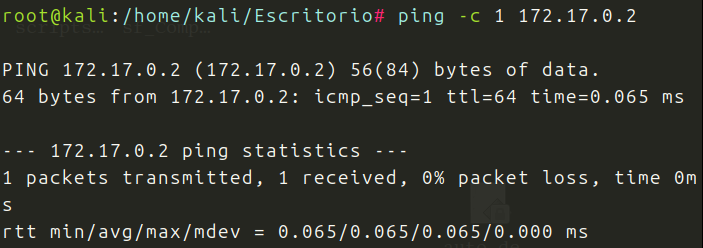

Hago un Nmap completo para ver puertos abiertos y servicios:

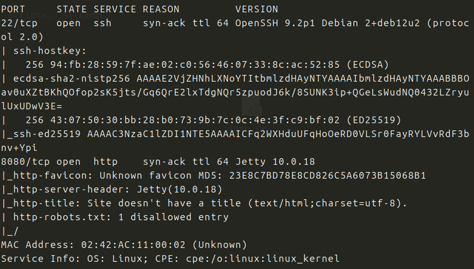

Bien, veo que tengo abiertos los puertos 22 y 8080(algo extraño este 8080).
Voy al navegador, nada.

Hago fuzzing web con gobuster sobre http://172.17.0.2:8080:

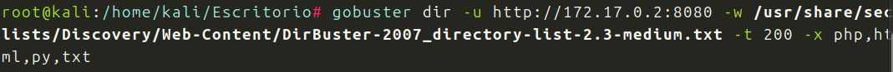
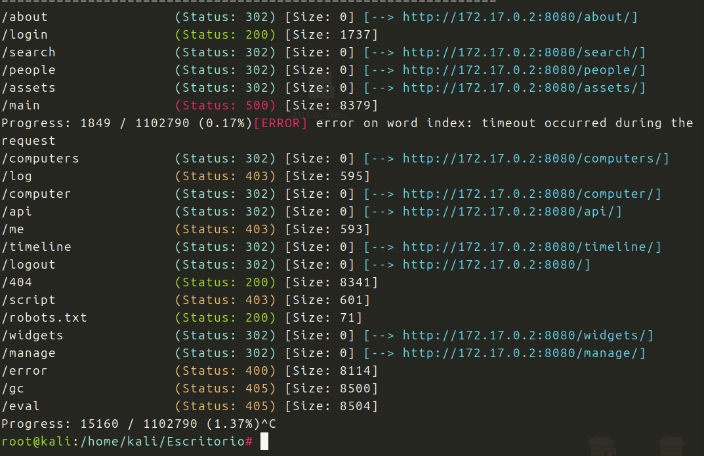

Tenemos varios directorios y archivos, voy a ver login:

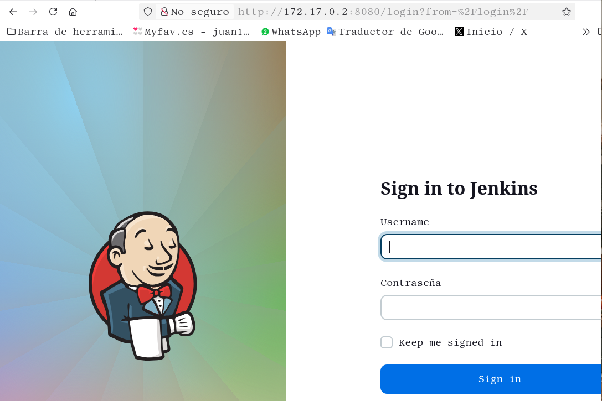

Tenemos un panel de login pero no tenemos ni usuario, ni contraseña, pruebo los mas comunes, pero no funcionan.
Vuelvo a los puertos abiertos, aver si encuentro alguna pista, busco posibles exploits en las versiones que tengo de SSH, hago whatweb ...

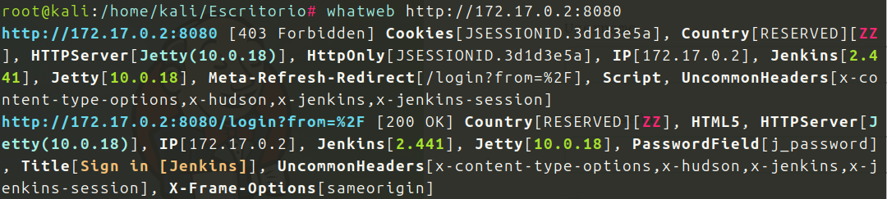

Busco exploits en esta version de jenkins:

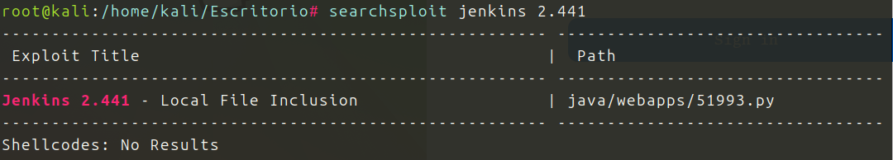

Bien, tenemos exploit. 
Veo que puede leer archivos.
Lo busco en la web y lo descargo como exploit1.py

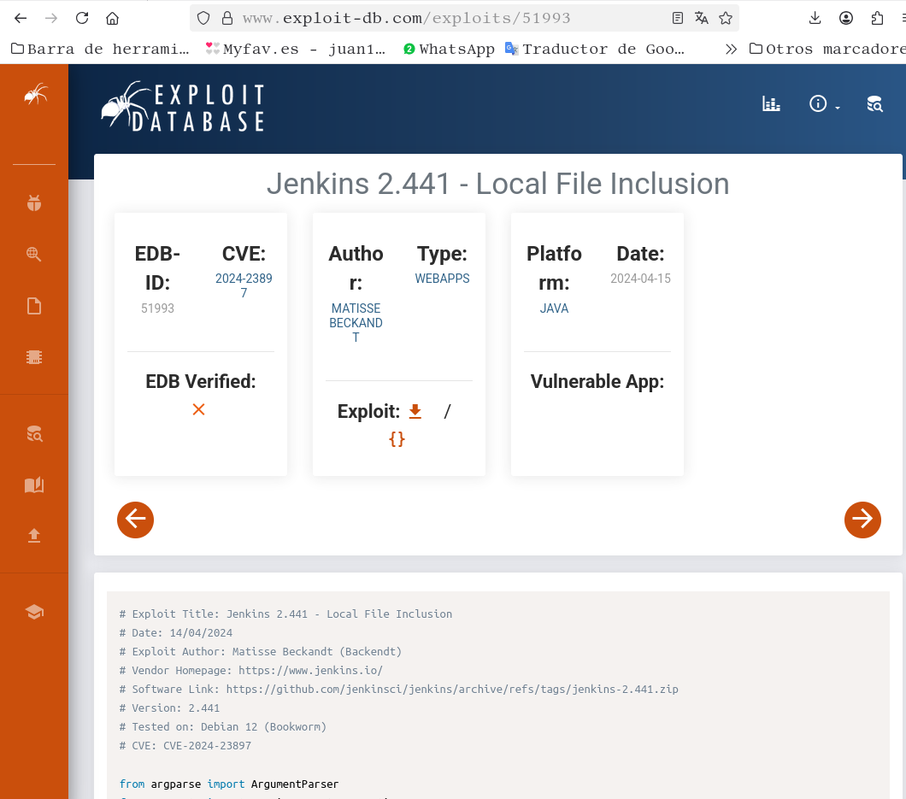

Le doy permisos, y lo ejecuto poniendo usuario y ruta:

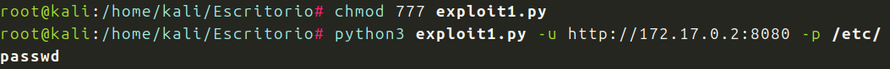
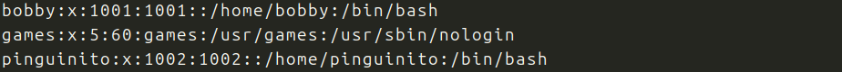

Funciona tengo usuarios, probare con hydra si saco la contraseña:

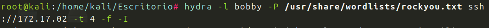
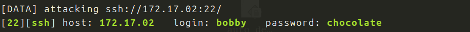

Estamos, entramos con SSH:

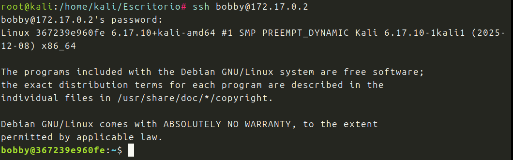

Somos bobby, probamos sudo -l:

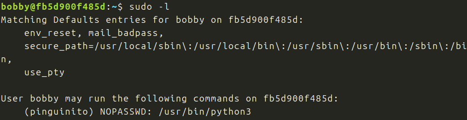

Tendremos acceso al usuario pinguinito, mediante el binario python3. Busco en GTFObins:

Soy el usuario pinguinito, sudo -l

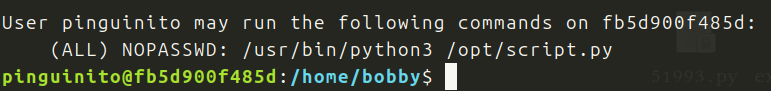

Tenemos un script.py veamos lo que hay dentro y que podemos hacer:

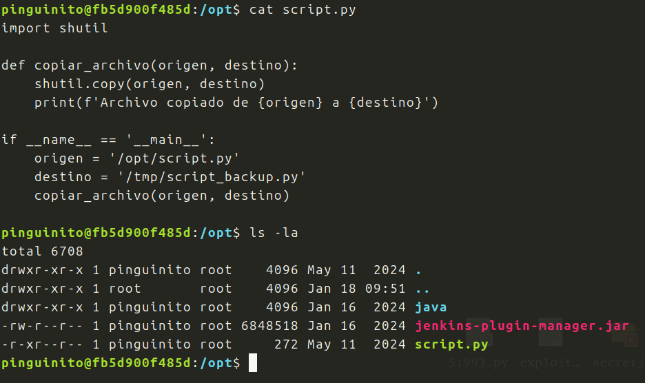

Es un simple archivo, que copia un archivo y lo envia a otro destino.
Tengo permisos de ejecucion y de lectura, pero no de escritura.
Puedo crear un archivo con el mismo nombre en el mismo lugar, y borrar el que hay.

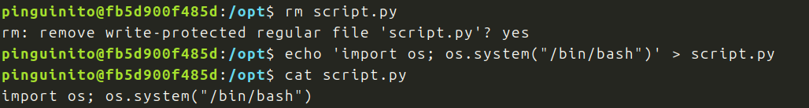

Aqui tenemos el script, le doy permiso de ejecucion y lo lanzo:

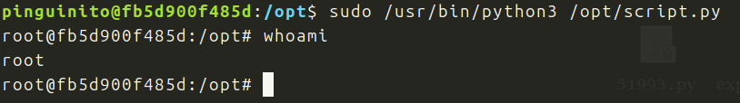

Conseguido, soy root!!
