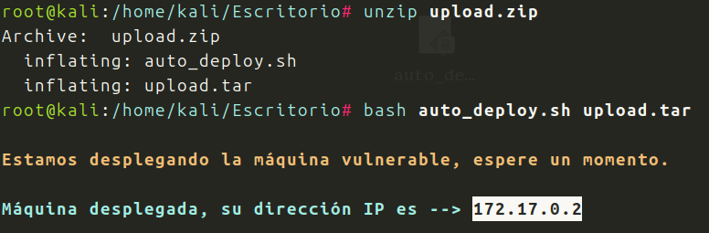

Descargo, descomprimo y corro la maquina Upload de Dockerlab, seccion Facil

Hago un nmap completo a ver que puerto y versiones corren:

![IMG-20260117003007788.png]]
![IMG-20260117003010983.png]]

Vemos el puerto 80 abierto, la maquina es Linux. Veamos el navegador:

![IMG-20260117003125041.png]]

Vale un pagina donde poder subir un archivos, perfecto. Tengo que hacer fuzzing para ver donde van los archivos subidos:

![IMG-20260117003748809.png]]
![IMG-20260117003751921.png]]

Vemos el directorio uploads, veamos que hay:

![IMG-20260117003857523.png]]

Una pagina donde llegan los archivos subidos. Bien creare un payload con PHP PentestMonkey y lo subire, a ver si admite .php y no hay problema

![IMG-20260117004132120.png]]

Tengo el archivo, lo subo y escucho con netcat, a ver si consigo una reverse shell

![IMG-20260117004332811.png]]

Estamos dentro, antes de nada, estabilizar la conexion:

![IMG-20260117004512220.png]]
![IMG-20260117004647731.png]]

Sesion estable. 
Escalada de privilegios.
Pruebo con sudo -l

![IMG-20260117004802982.png]]

Bien, mediante el binario env pedemos acceder a root, busco en GTFObins:

![IMG-20260117004933859.png]]

Probemos:

![IMG-20260117005048005.png]]

Conseguido!!!
