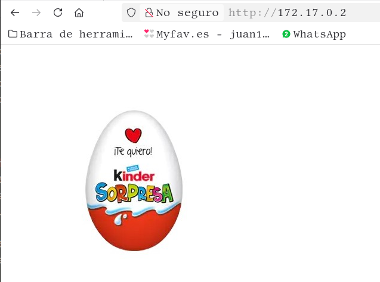
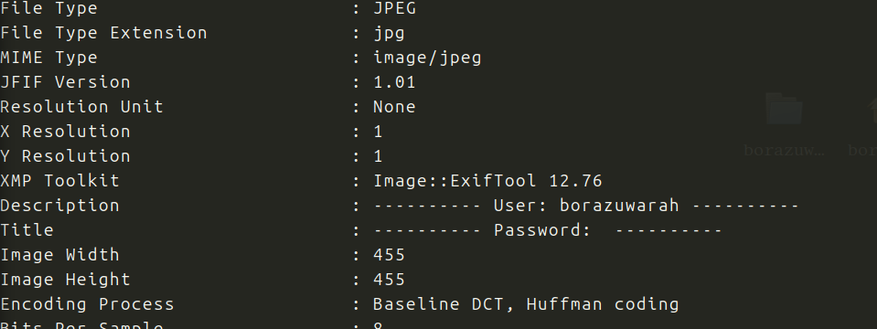
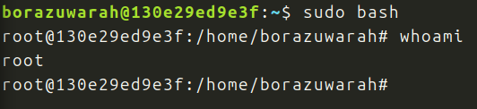

Maquina de Dockerlabs, categoria muy facil, veremos ...

La descargo, ejecuto y hago un nmap:

Abiertos 22 y 80, voy al navegador:

Sorpresa!!!

Reviso el codigo fuente, no hay nada.

Busco directorios o archivos con *gobuster*, no encuentro nada.

Descargo la imagen para analizarla con *exiftool*:

Tengo un usuario, probemos con hydra:

Tenemos usuario y contraseña:

Estamos dentro, probaremos con sudo -l

Pues hay suerte, buso en GTFOBins:

Lo meto directamente:

Conseguido!!

