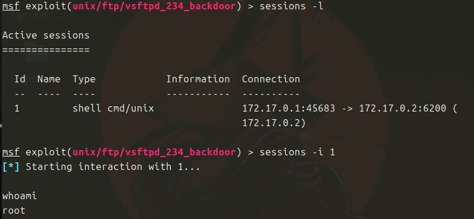
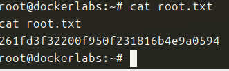

Maquina de Dockerlabs, nivel muy facil.

Descargo la maquina y la despliego.

Hago un nmap 

Puertos 21 y 80 abiertos, voy al navegador.
Nada, la pagina principal de apache.

Busco directorios o archivos ...

Solo el index.html ...

Pruebo otra cosa, quiza la version de vsftpd 2.3.4 sea vulnerable, pruebo con metasploit

Tenemos un exploit, tras ver las opciones solo me pide el RHOSTS, lo meto co corro y tengo una sesion abierta, pero se cierra rapido.

Compruebo el numero de sesion, y vuelvo a meterlo, funciona

Genero un prompt y busco la flag de root

Hecho, maquina facil!!
