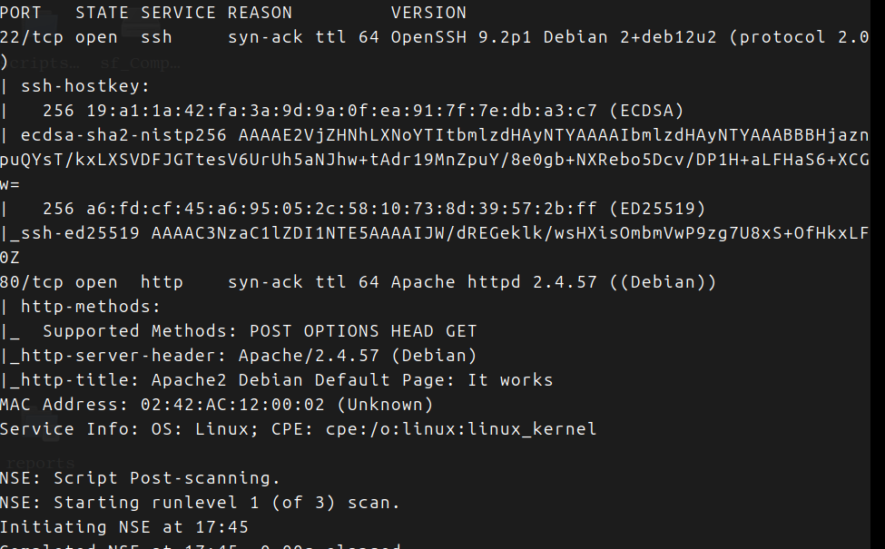
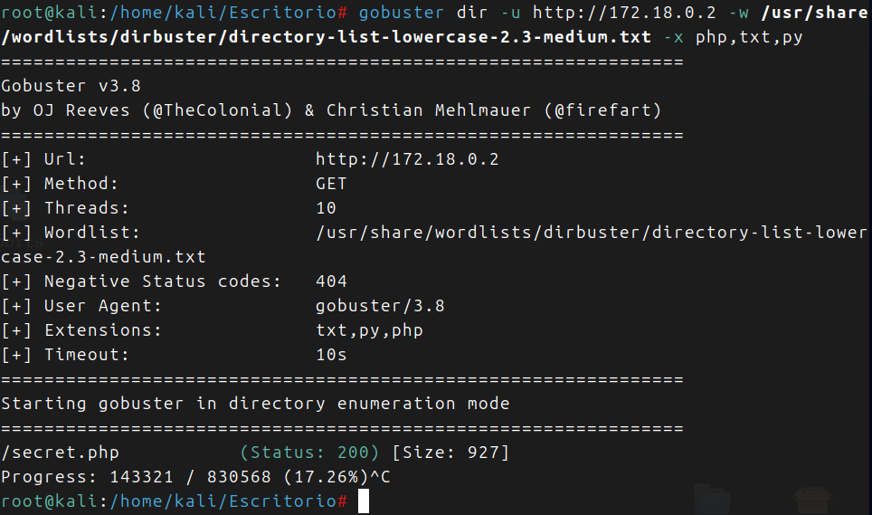
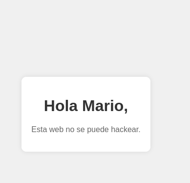
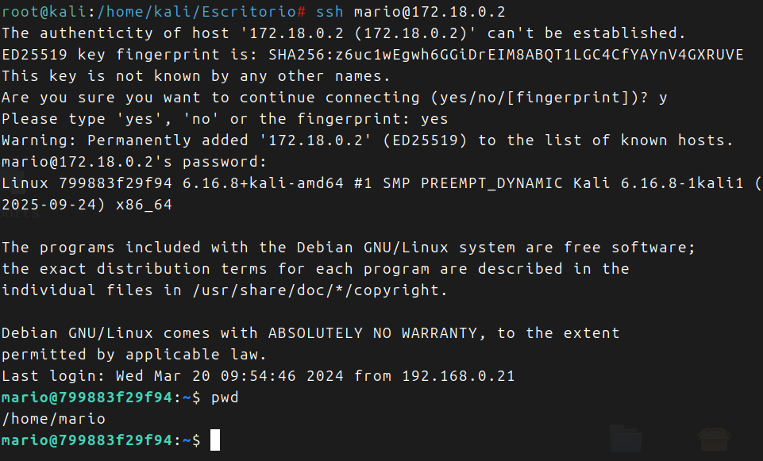
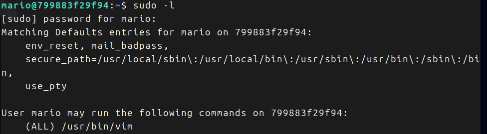
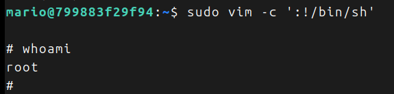

Descargo la maquina de Dockerlabs, muy facil pone, veremos.

Hago un nmap completo

Voy al navegador y veo la pagina de inicio de *Apache*.

Hacemos *fuzzing*:
Con *gobuster*  pasandole extensionesde archivos encuentro un archivo llamado secret:

Entro y veo esto:

Entiendo que mario puede ser el usuario, usare *hydra*:

Tenemos usuario y contraseña, y el puerto 22 abierto:

Estamos dentro!!!

Probamos *sudo -l*

Tenemos un *binario*, buscamos en *gtfobins*:

Lo probamos directamente:

Somos root!!!

