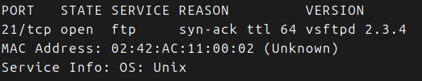
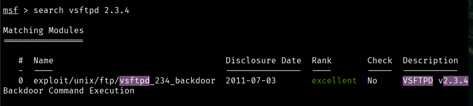
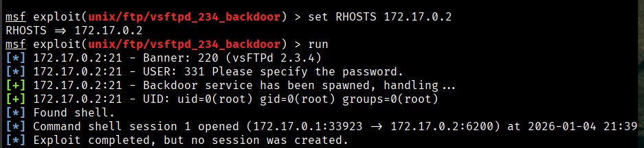

Maquina de Dockerlab, categoria muy facil.

Descargamos y desplegamos la maquina.

Hacemos un nmap completo.

Unicamente el puerto 21 abierto.

Veamos si con metasploit puedo conseguir algo metiendo la version de la vsftpd:

Bien tenemos un exploit, veamos que nos pide y lo metemos:

Nos pide la IP de la maquina victima solamente:

Lo meto, hay una sesion abierta, pero no creada ...

Busco y meto en numero de sesion y soy root!!

Para obtener un prompt:

