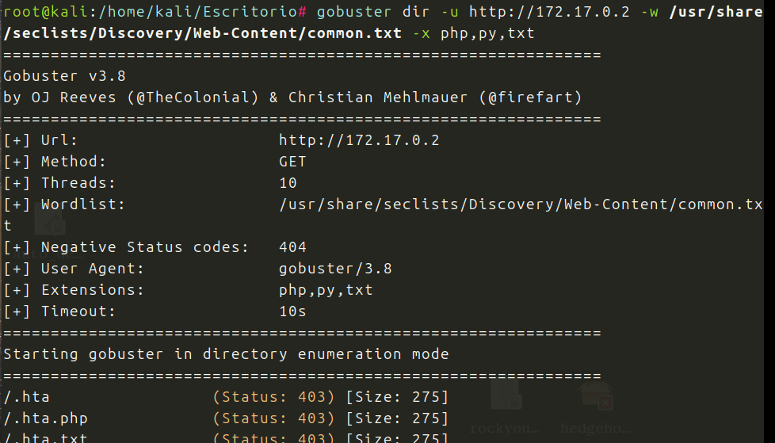
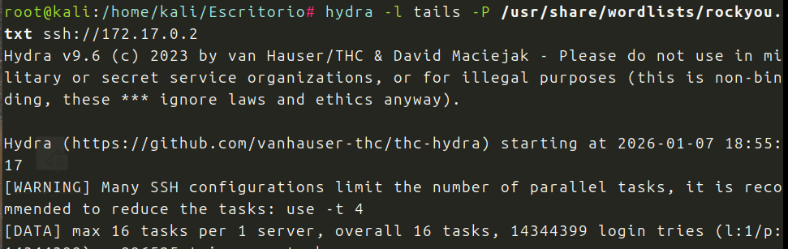
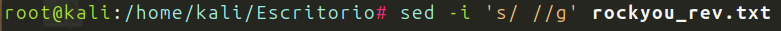
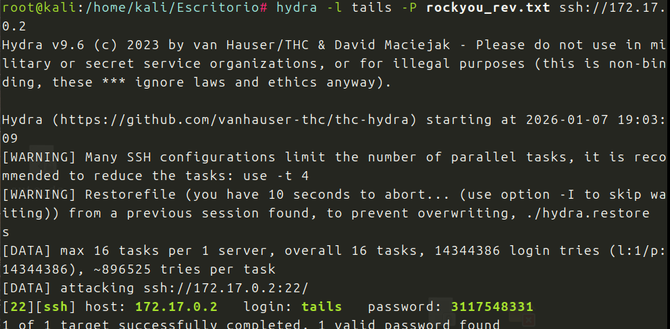
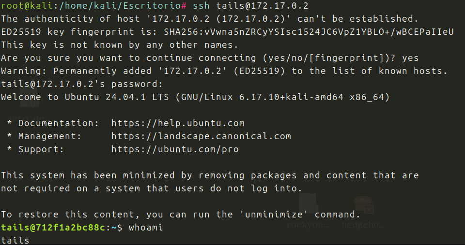
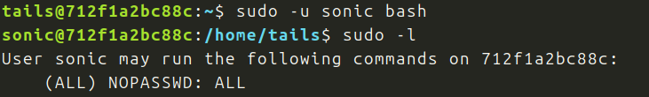

Maquina de Dockerlabs, de la seccion muy facil.

Descargamos y desplegamos la maquina.

Hago un *nmap* completo, para ver los puestos disponibles:

Abiertos *22 y 80*, voy al navegador:

Veo la palabra *tails,* ¿sera un usuario?

Voy a hacer *fuzzing con gobuster*, a ver si encuento algo:

Nada, unicamente una pagina *index.html*, es es la que ya conozco.

Probare con *hydra*

Tarda muchisimo, quiza la palabra este al final del Diccionario, le do y la vuelta:

Tras mirar el final del archivo veo huecos vacios, los voy a eliminar:

Vale ahora si corro hydra con el Diccionario al reves y sin huecos:

Password encontrado, voy a entrar por SSH

Estoy dentro soy tails.
###### Escalada de Privilegios
Pruebo sudo -l

Podemos pivotar al usuario *sonic*

Ahora vemos que podemos escalar a root sin mas:

Somos root!!!
