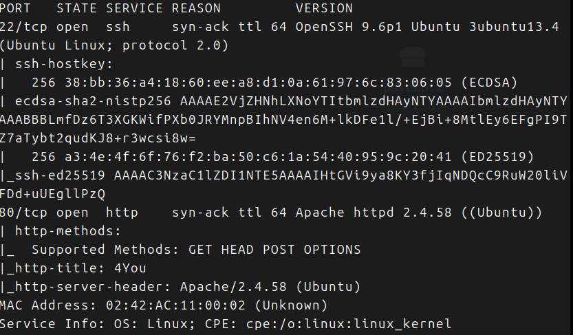
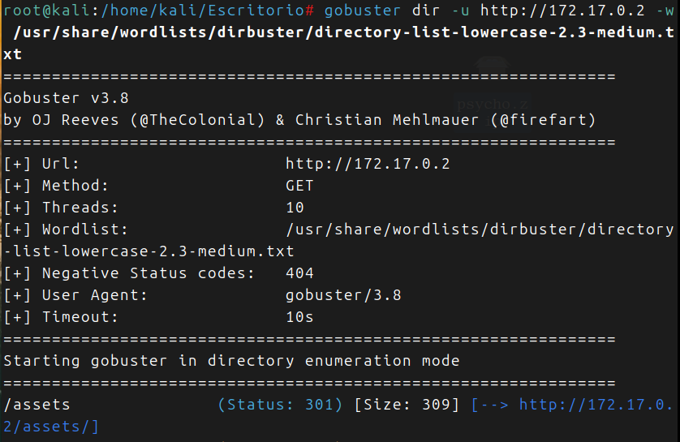
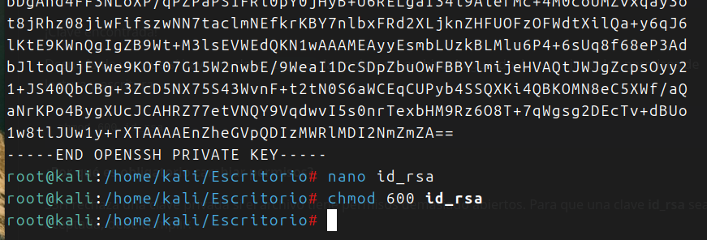
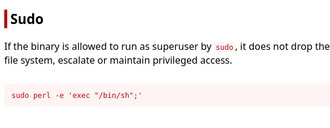

> [!important] Dockerlabs
> La maquina psycho pertenece a Dockerlabs, es sobre la que vamos a trabajar, vamos a intentar vulnerar.
> Desde la pagina de Dockerlabs, la descargamos en Kali, la llevamos al Escritorio, descomprimimos y nos metemos en la carpeta. 
> La corremos con: *sudo bash auto_deploy.sh psycho.tar*
> Empezamos ...

Con nmap vemos las siguientes puertos abiertos:

Vamos al navegador por el *puerto 80*, nada que me llame la atencion, excepto en la parte de abajo un mensaje de error. Examino el codigo fuente, no veo nada raro.

Hay que hacer fuzzing, usare *gobuster* en un principio:

Tenemos el directorio */assets/*, veamos que hay:
- Una imagen que no me da ninguna pista.

Sigo con el fuzzing:

Descubro un archivo oculto, posible LCI, probamos:

He hallado usuarios:

Pruebo a ver si hallo la clave privada de luisillo: Nada
Pruebo a ver si hallo la clave privada de vaxei: Perfecto esta

Y hallamos la 'PRIVATE KEY':
- La copio y le doy permisos, 600 en este caso

Pruebo a entrar por el puerto 22:

Estoy dentro, soy vaxei.

Probamos con sudo -l

Busco en la pagina gtfobins:

Pruebo con el nombre del otro usuario:

Funciona soy luisillo

Volvemos al sudo -l

Veo un archivo paw.py, subo al directorio y lo abro:

No tengo permisos para editar el archivo, asi que hare Python Library HiJacking:

- veo que se importa subprocess, intentare cambiarlo

Cuando lo importe, me dara acceso ... 

